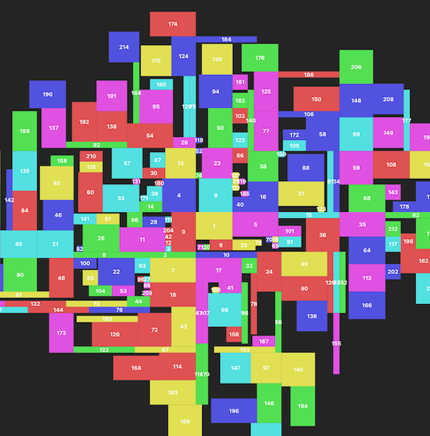

# Spiral Layout Demo

A demo application showcasing a spiral layout algorithm with SolidJS for rendering. The algorithm places boxes in a spiral pattern, maintaining efficient space usage while avoiding overlaps. The new boxes can be added progressively making it a good fit for streamable content.

Deployed demo [https://spiral-layout.netlify.app](https://spiral-layout.netlify.app).



## Usage

- Watch random box being added every second
- Click anywhere to add a random box
- Observe the spiral pattern formation
- Scroll mouse wheel to zoom in/out


### Build

```bash
pnpm build & pnpm preview
```

### Development

```bash
pnpm dev
```

### Testing

**Attention!** Tests are expectedly broken at the moment.

```bash
pnpm test
```

## License

MIT License
